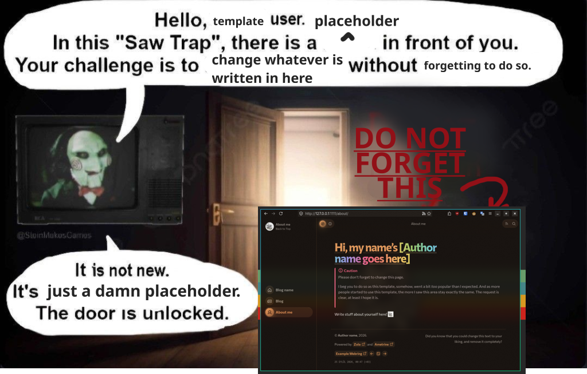

+++
title = "About me"
description = "Some stuff about me, this is a template, yadda yadda yadda. If you see this, then the owner forgot to update some stuff from the template. Especially some people got a very, very crude message that was a remnant from my- I mean, the template owner's website 😭"
generate_feeds = true

[extra]
no_header = true
+++

# Hi, my name's [Author name goes here]
> [!CAUTION]
> Please don't forget to change this page.
>
> I beg you to do so as this template, somehow, went a bit *too* popular than I expected.
> And as more people started to use this template, the more I saw this area stay exactly the same. The request is clear, at least I hope it is.
> 
> <figcaption>...please 😭</figcaption>

Write stuff about yourself here! {{ sticker(path="/emoji/trolley.png", name="trolley") }}
